# Credit Card Fraud Detection
Credit Card Fraud Detection Project 4 Team 6  (Nesihlan Atar, John Ellis, Gurans Limbu, Daniel Morris)  
Dataset located on: 
[Kaggle](https://www.kaggle.com/datasets/kelvinkelue/credit-card-fraud-prediction)  
To run the notebooks supporting this analysis the Fraud_test.csv file must be placed in a folder called 'Resources' directly below the folder containing the notebooks.  

## An Overview of the project and its purpose:  
To create a binary classification machine learning model to identify fraudulent transactions within a population of 555718 transactions.  The labeled dataset consisted of the following 22 features:  

1. Trans_date_trans_time: Timestamp of the transaction (date and time).  
2. Cc_num:Unique customer identification number.  
3. MerchantThe merchant involved in the transaction.  
4. Category Transaction type (e.g., personal, childcare). 
5. Amt:Transaction amount.  
6. First: Cardholder's first name.  
7. Last Cardholder's last name.  
8. Gender: Cardholder's gender.  
9. Street: Cardholder's street address.  
10. City: Cardholder's city of residence.
11. State: Cardholder's state of residence.
12. Zip: Cardholder's zip code.
13. Lat:Latitude of cardholder's location.
14. Long: Longitude of cardholder's location.
15. City_pop:Population of the cardholder's city.
16. Job:Cardholder's job title.
17. Dob: Cardholder's date of birth.
18. Trans_num: Unique transaction identifier.
19. Unix_time: Transaction timestamp (Unix format).
20. Merch_lat:Merchant's location (latitude).
21. Merch_long: Merchant's location (longitude).
22. Is_fraud:Fraudulent transaction indicator (1 = fraud, 0 = legitimate). This is the target variable for classification purposes.

The project was broken into 7 parts.
1.  Descriptive analysis:  a review of the features and how they relate to the target variable.
2.  Target variable review  
3.  Feature Engineering and Data Preprocessing   
4.  Selection of the objective metric(s) for model assessment.
5.  Assessing various types of machine learning algorithims with minimal tuning.
6.  Selecting "best" algorithim from the set of algroithims assessed for hyperparamater tuning.
7.  Tuning the chosen model for optimal performance
___
## Part 1 Descriptive Analysis 
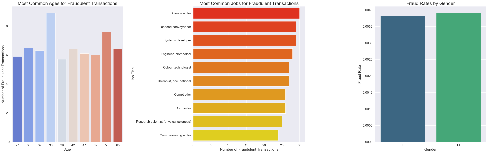
The fraud rates of males are higher than female rates, and the age with the highest incidence of fraud is 38

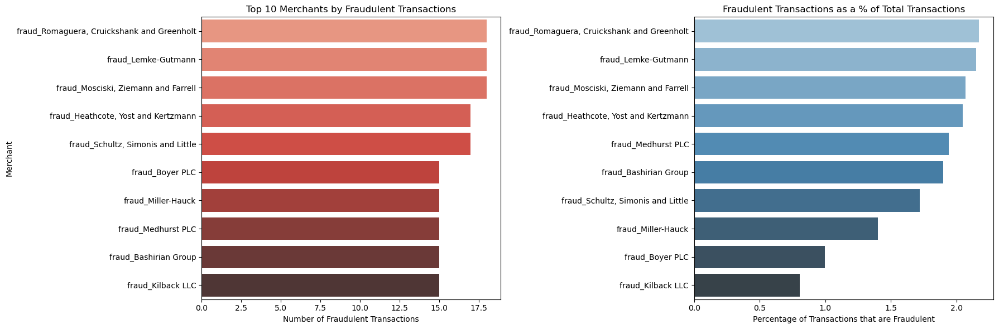
Top 10 Merchants by Fraudulent Transactions
In the chart showing 'Top 10 Merchants by Fraudulent Transactions', we see that fraud
isn't uniformly distributed across merchants. Certain merchants like 'fraud_Romaguera,
Cruickshank and Greenholt' have higher instances of fraud, which may suggest either targeted attacks by fraudsters
or potential vulnerabilities in the merchant's transaction processing systems.

Fraudulent Transactions as a Percentage of Total Transactions
Finally, the chart 'Fraudulent Transactions as a % of Total Transactions' offers a different perspective,
showing that while some merchants may have a high number of fraudulent transactions in absolute terms,
it represents a smaller fraction of their total transaction volume. Conversely, other merchants have a higher
percentage of their transactions flagged as fraudulent, which could be concerning despite a lower overall number
of transactions.
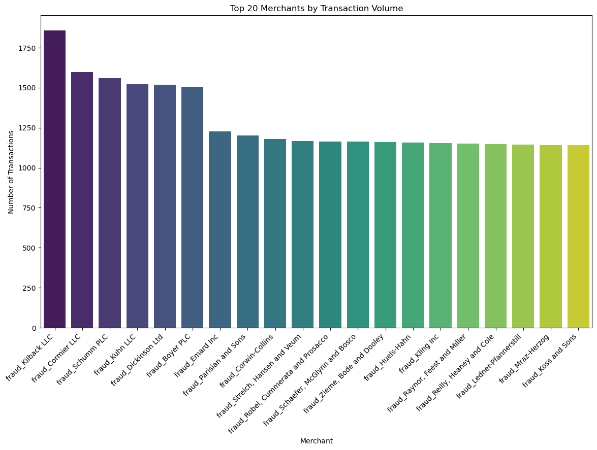
The 'Top 20 Merchants by Transaction Volume' chart highlights merchants with high transaction volumes,
which could be due to several factors such as widespread locations, diverse offerings,
or competitive pricing strategies that attract more customers.  

How do transaction amounts vary across different merchants

The box plot below shows top 10 Merchants with the highest average transaction amount. I excluded the outliers for better visualization. All of the medians for these merchants are very similar, all the medians are around $6-$7 dollars. The middle 50% of transactions are all similiar as well ranging roughly around $4-$9. All of the bottom lines start at about $1 suggesting lowest priced good at all these places is $1. THe top 25% of all transactions are can vary a lot by merchant. The top lines show that maximum price is at $9-$17. None of the top 20 from above bargraph are in the top 10 in below boxplot, suggesting that most popular merchants are not the most expensive. For example nofrills would have more transactions than Guess but nofrills transaction coulbe be smaller in amount compared to Guess.
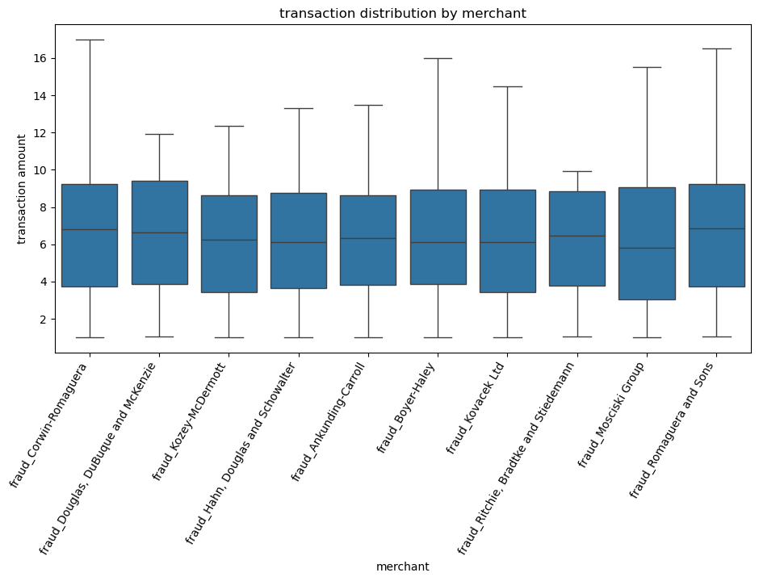

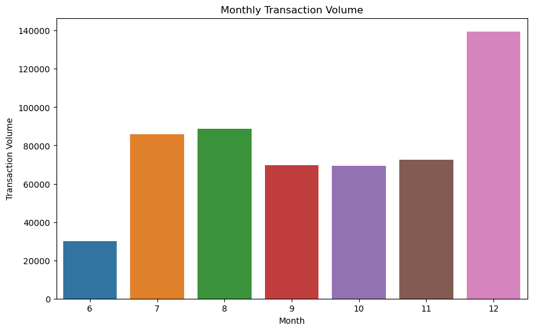  
The 'Monthly Transaction Volume' chart reinforces the idea of increased end-of-year spending with a
dramatic spike in December, likely due to holiday shopping.

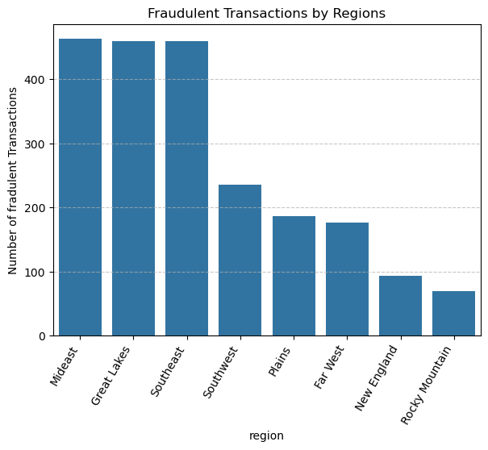  
There appears to be signifciant variance in transactions by region.

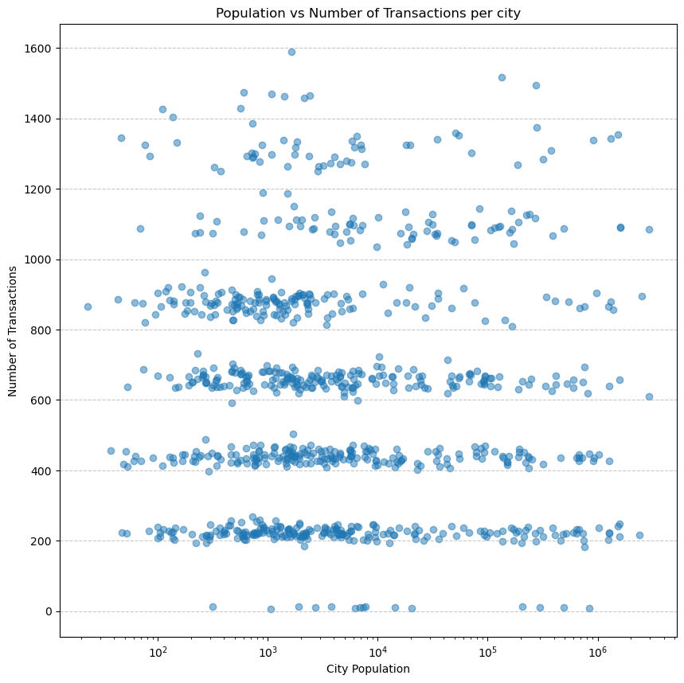

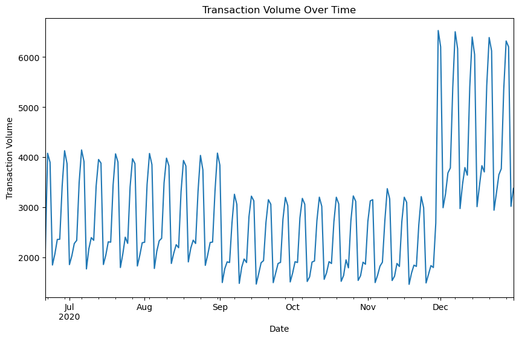    
The 'Transaction Volume Over Time' chart exhibits a clear cyclical pattern, indicating weekly fluctuations
in transaction volume. Peaks might correspond with weekends or paydays when consumers are more likely to spend.
The rising trend towards the year's end suggests increased spending during the holiday season.
___
## Part 2 Target Variable Review
The dataset consisted of 555718 transaction records of which 2145 were fraudulent (0.3860%).  The labels therefore are highly imbalanced and steps were taken to address the impact of this imbalance on the models.  
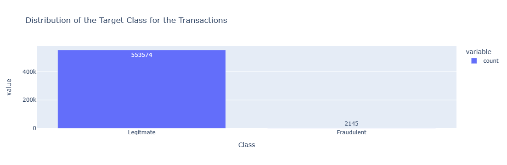
___
## Part 3 Feature Engineering and Data Preprocessing
After performing a descriptive analysis of the data a number of features were dropped or created then encoded/transformed and scaled:   
1. **Dropped Features**: 'First' Name, 'Last' Name, 'cc_num', 'street', 'city', 'state', 'dob', 'Trans_num', 'Unix_time', 'Lat', 'Long', 'Merch_lat', 'Merch_long'.  The personal identification data was dropped as we didn't want it to influence the analysis, we wanted to find the fraudulent customer without knowing their exact ID.  Transaction features like Trans_num, Unix_Time were also dropped as they do not correlate to the incidence of fraud.  
3. **Created Features**:  
 - 'Region', an amalgamation of U.S. States according to the  [U.S. Bureau of Economic Analysis](https://www.bea.gov/).
 - 'Age_years', the age of the cardholder based on the difference between today's date and the cardholders DOB.
 - 'Distance_km', the distance between the cardholders latitude and longitude and the merchants latitude and longitude.
4. **Encoding Features with few categories**: binary or get_dummies encoding was used to encode catagories: 'gender' and 'region'; features with fewer than 20 members.
6. **Transformed Features**: 'amt' (Transaction Amount) due to the very high dispersion in this feature it was transformed by the natural log.  
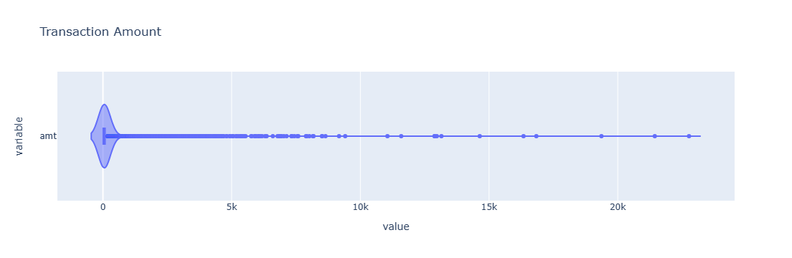
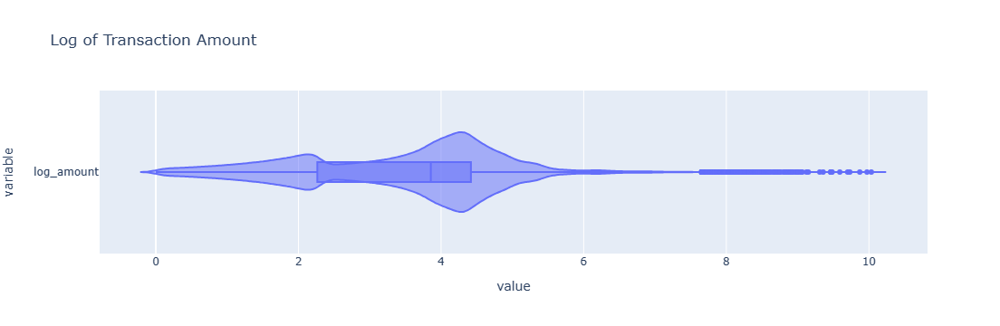

7. **Spliting into Training and Testing Sets**: The resulting data set was split into training and testing sets with 75% of the data used for training and 25% was used for testing.  Due to the very high imbalance in target labels (classes) the training and test splits were reviewed to ensure an adequate number of labels were assigned to each set.    
                `Average class probability in data set:     0.003860`  
                `Average class probability in training set: 0.003839`  
                `Average class probability in test set:     0.003923`

8. The distribution of the y_postive and y_negative labels were reviewed.  
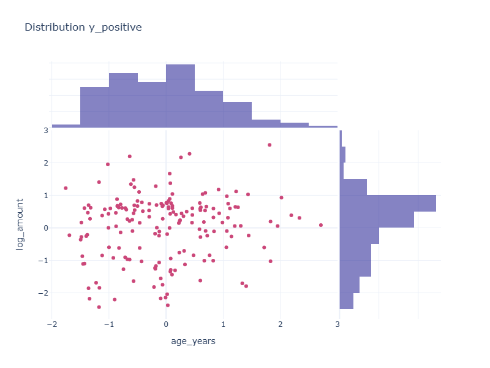
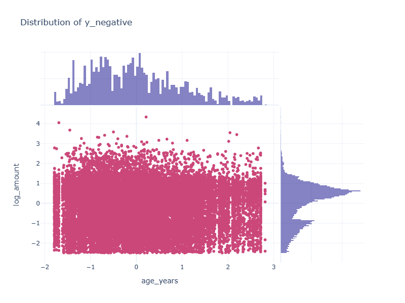

6. **Encoding Features with Extensive Categories**: Target encoding was used to encode the 'merchants', 'jobs' features.  It was applied after the data had been split into train and test sets.  The target encoder was fit to the training data, the resulting encoder was used to transform both the training and testing sets.
7. **Scaling**: Sci-kit Learns standard scaler was fit to the training features and both the training and testing features were transformed with the resulting scaler.   
___
## Part 4 Selection of the objective metrics for model assessment
As recommended by Scikit Learn[1](Footnotes:) Balanced Accuracy is a more appropriate objective metric over accuracy when working with imbalanced classes in the target, as it weighs each sample according to the inverse prevlaence of its true class.  It is this metric that is used to assess each model's performance.
___
## Part 5 Assessing various machine learning algorithms.
The following models were reviewed for their ability to achieve a balanced accuracy score while maximizing the recall of the model.

### 1. Logistic Regression  
`         Confusion Matrix: LogisticRegression`  
`         Predicted Legitimate 0	Predicted Fraudulent 1`  
`Legitimate 0	138366	                    19`  
`Fraudulent 1      520	                    25`  
`Accuracy Score :         0.9961`  
`Balanced Accuracy Score: 0.5229`  
`                        Classification Report`  
`              precision    recall  f1-score   support`  

           0       1.00      1.00      1.00    138385
           1       0.57      0.05      0.08       545

`    accuracy                           1.00    138930`  
`   macro avg       0.78      0.52      0.54    138930`  
`weighted avg       0.99      1.00      0.99    138930`

The logistic regression model as illustrated above has a mediocre performance when attempting to predict the fraudulent records in the test set as evidenced by the recall of 0.05 where approximately 1 in every 20 fraudulent transactions were detected.  This low performance is further illustrated by the 0.52 balanced accuracy score achieved.  Based on this result we moved onto a non-linear model.

### 2. K-Nearest Neighbors  
`        Confusion Matrix: KNNModelclassifier`  
`        Predicted Legitimate 0	Predicted Fraudulent 1`  
`Legitimate 0  138377	                 8`  
`Fraudulent 1     542	                 3`  
`Accuracy Score :         0.9960`  
`Balanced Accuracy Score: 0.5027`  
`                         Classification Report`  
`              precision    recall  f1-score   support`  

`           0       1.00      1.00      1.00    138385`  
`           1       0.27      0.01      0.01       545`  

`    accuracy                           1.00    138930`  
`   macro avg       0.63      0.50      0.50    138930`   
`weighted avg       0.99      1.00      0.99    138930`  

In our evaluation of the KNN model for predicting fraudulent transactions, we achieved an impressive overall accuracy of 99.60%, indicating its proficiency in classifying transactions accurately. However, the dataset's imbalance is evident in the balanced accuracy score of 50.27%, revealing limitations in its performance. While the model excels in identifying legitimate transactions, it struggles with fraudulent ones, as indicated by the low recall of 1%. This leads to numerous false negatives, missing instances of fraud. Additionally, the precision of 27% highlights a high rate of false positives, where legitimate transactions are misclassified. These findings underscore the importance of refining or exploring alternative models to enhance fraud detection capabilities. Although the KNN model demonstrates strong accuracy overall, addressing its limitations in correctly identifying fraudulent transactions is paramount for effective fraud prevention strategies.

### 3. Random Forest Classifier
`       Confusion Matrix: RandomForestClasssifer`  
`       Predicted Legitimate 0	Predicted Fraudulent 1`  
`Legitimate 0 138352	               33`  
`Fraudulent 1    208	              337`  
`Accuracy Score :         0.9983`  
`Balanced Accuracy Score: 0.8091`  
`                       Classification Report`  
`              precision    recall  f1-score   support`  

`           0       1.00      1.00      1.00    138385`  
`           1       0.91      0.62      0.74       545`  

`    accuracy                           1.00    138930`  
`   macro avg       0.95      0.81      0.87    138930`  
`weighted avg       1.00      1.00      1.00    138930`  

The random forest classifier generated the following feature importances:  
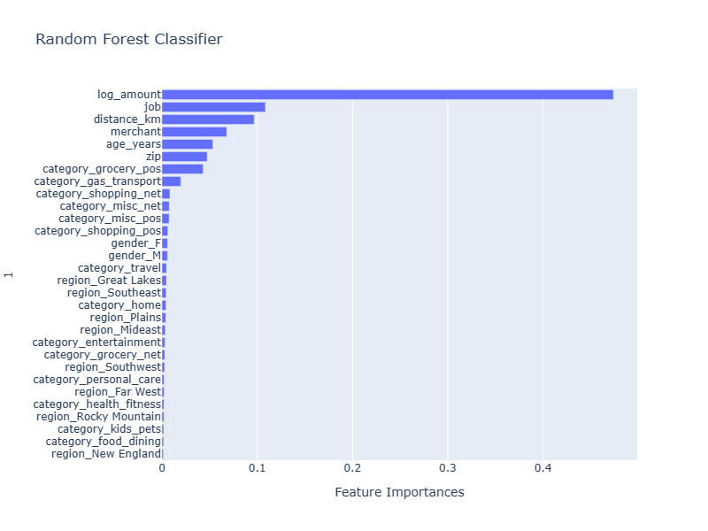  
Next we reviewed an ensemble random forest model which was much more performant than the previous two models. With this model we started to see a more acceptable balanced accuracy score (0.81) but the model was able to predict fraudulent transacitons 62% o  . X time.

### 4. XGBoost with postive scaling of labels
`        Confusion Matrix: XGBoost Baseline Model`  
`        Predicted Legitimate 0 	Predicted Fraudulent 1`  
`Legitimate 0	137580	                 805`  
`Fraudulent 1	    50	                 495`  
`Accuracy Score :         0.9938`    
`Balanced Accuracy Score: 0.9512`  
`                       Classification Report`  
`              precision    recall  f1-score   support`  

`           0       1.00      0.99      1.00    138385`  
`           1       0.38      0.91      0.54       545`  

`    accuracy                           0.99    138930`  
`   macro avg       0.69      0.95      0.77    138930`  
`weighted avg       1.00      0.99      1.00    138930`  

Given the high ,target imbalance t,he XGBoost model with it's ability to aceter which helps to compensate for the class imbalance, performs much better thanthe other algorothims considered.  The parameter [2](Footnotes:)'scale_pos_weights' is set to the ratio of negative transactions to positive transactions. (sum(negative_y)/sum(positive_y)) or 259.0 which when applied removes the imbalance in th during model fittinge target classes.

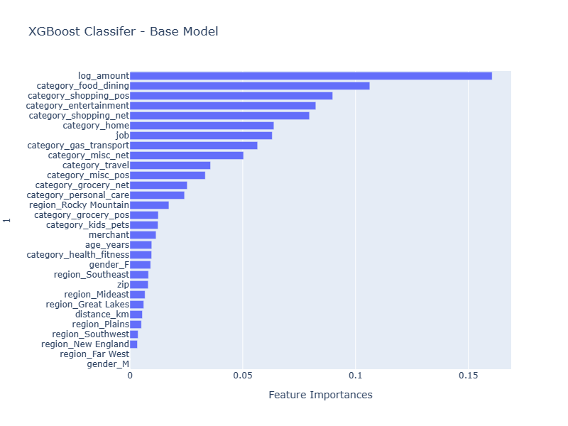
## Part 6 Algorithm Selection
After reviewing the model results XGBoost was selected for hyper-parameter tuning because:
1. XGBoost has facilities to address imbalance in the target class.
2. XGBoost has a robust parameter fram hyper-parameterework to support tuning.
3. XGBoost showed the most performance in the objective metric (balanced accuracy) from the algorithms reviewed.
___
## Part 7 Tuning XGBoost and selecting the best model.
The parameters selected to be tuned were:  
1. The number of boosting rounds to run (32,64,128,256,512) 
2. The maximum depth of the trees created (2, 4, 6, 8, 10, 12)  
3. This results in 30 distinct models being evaluated.

The results were as follows:
1. From the 30 models run by the tuner, 6 (20%) of the models met the primary requirement of meeting 0.965 balanced accuracy.
2. From the 6 models 3 (50%) met the requirement of being within 1 standard deviation of the model with the highest precision.
3. Of these 3 models the one with which rendered the fastest prediction was selected as the **BEST** model.  

The tuning objective was set to maximize the balance accuracy score and secondarily model precision.  Precision was chosen in an attempt to minimize the rate of false positives. 

`          Confusion Matrix: XGBoost Grid Search Best Model`   
`          Predicted Legitimate 0	Predicted Fraudulent 1`  
`Legitimate 0	135526	                2859`    
`Fraudulent 1	    10	                 535`  
`Accuracy Score:          0.9793`  
`Balanced Accuracy Score: 0.9805`   
`                       Classification Report`  
`              precision    recall  f1-score   support`  

`           0       1.00      0.98      0.99    138385`  
`           1       0.16      0.98      0.27       545`  

`    accuracy                           0.98    138930`  
`   macro avg       0.58      0.98      0.63    138930`  
`weighted avg       1.00      0.98      0.99    138930`  

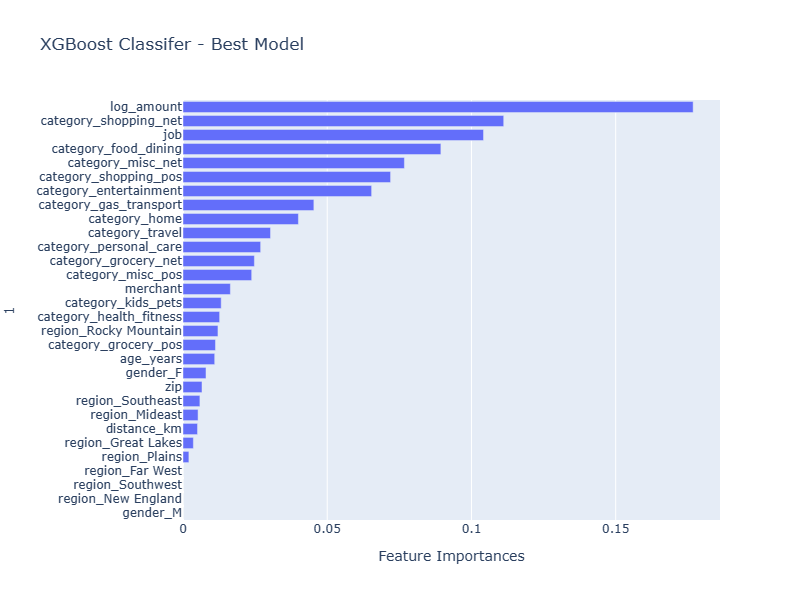

## Comparative Feature Importance by Model
One constant howerver is the log_amount of the transaction is the most significant feature in each model.  Beyond that the importance of the features differs significantly from model to model. The XGBoost Base Model and XGBoost BEST model share a number of features in common when ranked by importance. An opportunity for further analysis may be to remove some of the least significant features from model consideration in the XGBoost best Model and see if the performance improves.

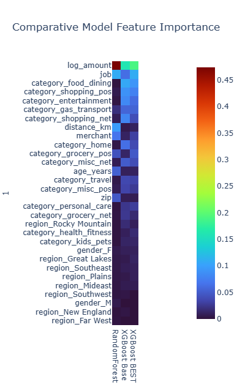
___
### Footnotes:
[1]
[Scikit Learn - Balanced Accuracy Score](https://scikit-learn.org/stable/modules/generated/sklearn.metrics.balanced_accuracy_score.html#sklearn.metrics.balanced_accuracy_score)  
[2]
[XGBoost - Control of positive and negative weights](https://xgboost.readthedocs.io/en/stable/parameter.html)
### Repository Structure:  
- Root Folder: all scripts used to generate the analysis components
- src\Fraud.py: a file of custom scripts used in the analysis.
- img\various.png: a folder containing the images displayed in this README.md  
___

The following data science and visualization technologies were used in creating this analysis:

  
  
  
  
  
